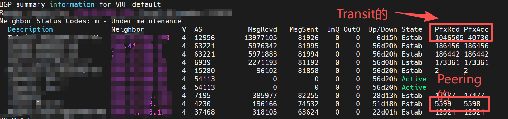
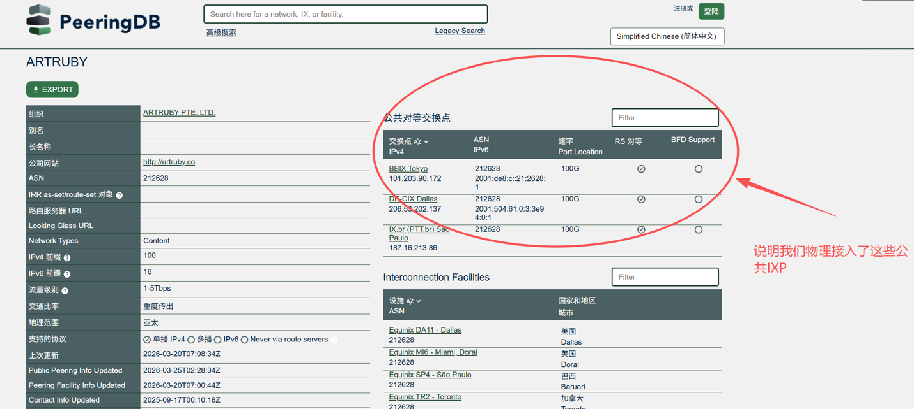

## 1. BGP协议
我并不是网络工程师出身, 对于具体的交换机和路由器的配置我也不怎么清楚，下列的内容是我最近处理BGP问题的时候自己边查边学的，所以总感觉有些地方讲的不够透彻。

首先是一些在接下来会经常会提到的概念:

- IXP - 公共BGP服务商
- PIX - 服务商在机房里面的交换机
- Cage -  数据中心里用铁丝网或玻璃墙围起来的一个独立区域, 里面可以放很多个机柜
- Cabinet / Rack（机柜）- 标准的 42U 服务器机柜
- ISP - 网络服务器提供方，可以认同为 运营商
- RIR - 区域互联网注册机构, 实体向这些 RIR 申请 ASN

### 1.1 BGP协议和ISP
学习过计算机网络这门课的朋友们应该都听说过BGP协议(Border Gateway Protocol):  互联网是通过一个个自洽系统AS(Autonomous System)连接起来的，不过的管理机构分别控制自己的自洽系统，这个管理机构就是我们常说的ISP(Internet Service Provider)。

为了区分不同的AS系统，IANA（互联网号码分配局） 将 ASN块批发给 RIR, 然后RIR为每个实体(除了ISP以外，任何有数据中心业务的公司都可以申请)颁发了一个全球唯一的编号，这就是 **ASN (Autonomous System Number)**。

比如说比较熟悉的ASN如下所示，:
- AS4134 --> 中国电信163骨干网
- AS15169 --> Google
- AS16509 --> Amazon

### 常用查询网址
可以通过这两个网址来查看对应IP地址现在由哪个ASN所有，又由哪个ASN所宣称:
* https://ipinfo.io/
* https://bgp.he.net/ip

```查出来的结果是这样
{  "ip": "2.59.151.x",
  "asn": "AS40065",
  "as_name": "CNSERVERS LLC",
  "as_domain": "cnservers.com",
  "country_code": "US",
  "country": "United States",
  "continent_code": "NA",
  "continent": "North America"
}
```
### 1.2 ASN在网路安全上的内容
在我们的日常生活中，肯定会好奇，为啥自己挂了VPN，结果在注册Ins或者Telegram,或者别的什么的时候，无法验证通过。这时候就是ASN在发力了:

- 精准区分“机房 IP”与“住宅 IP”: 一个来自美国的 IP，如果其 ASN 属于 DigitalOcean (AS14061) 或 Amazon (AS16509)，那么 99% 的概率这是一台数据中心的服务器（即机房 IP，极大概率是爬虫、代理）。因为谁家好人从机房里面注册社交媒体呀，但如果其 ASN 显示为 Comcast Cable (AS7922)，这代表该 IP 是直接由美国最大的家庭宽带服务商分配的，具有极高的真人属性，这就是电商和广告反欺诈系统极力渴求的“高信誉住宅 IP (Residential IP)”。

- 溯源 DDoS 攻击源头: 当遭遇僵尸网络发起的反射型 DDoS 攻击时，防御者通过聚合攻击包的源 IP 并反查 ASN，能迅速摸清哪些劣质的小型 IDC 数据中心没有开启源地址伪造过滤（BCP38），从而直接从 BGP 路由层切断来自这些高危 ASN 的所有入站流量。

- BGP路由劫持: 因为整个互联网的寻路机制完全建立在各个 ASN 互相之间“基于信任的路由宣告”上。如果一个非法的 ASN 突然向全球广播：“所有去往 AS15169 (Google) 的流量，现在走我这里最近！” 那么由于 BGP 协议早期的设计缺陷（缺乏严格的加密校验机制），周边的路由器真的会把原本去往 Google 的流量全部导向这个恶意 ASN。

这种骇人听闻的底层攻击被称为 **BGP 路由劫持 (BGP Hijacking)**。历史上曾多次发生过某个国家的运营商由于错误配置或恶意目的，瞬间吞噬了全球飞往 YouTube 或特定加密货币交易所的海量流量，导致全球范围的大规模断网或流量监听。

### 1.3 谁在管理全球的IPV4?
全世界的互联网IPV4网段就这么多，目前是由非盈利组织 IANA 分配的，并且也是按层级进行分配的

- IANA (顶层)：全球互联网数字分配机构。它把巨大的地址池分给全球 5 个 RIR（区域互联网注册机构）。
- RIR (区域级)：几乎可以理解五大洲就是五个RIR
    - FRINIC：负责整个非洲。
    - APNIC：负责亚太地区（包括中国、日本、澳大利亚、东南亚等）。
    - ARIN：负责北美地区（美国、加拿大及部分加勒比海岛屿）。
    - LACNIC：负责拉美及加勒比海地区
    - RIPE NCC：负责欧洲、中东及中亚。
- LIR/ISP (机构级)：机房或运营商（如 IDC Servers）从 RIR 申请/购买地址, 比如华为，联通，XX机房这个样子

顺带一提，并不是说机房可以随便申请一堆IP地址，这个IP地址只能租赁，没有买断一说。一个/24的地址一年的年费差不多1300美元了。而且还有开户费，IP地址的年费，你的ASN号的年费。而且IPV4的地址早在2011年就耗尽了，基本不可能直接从PIR那里拿到新的地址，所以很多公司现在都是去二手市场找别的公司买，那就更贵了，所以现在都在大批的搞IPV6改造。

## 2. 机房里面的BGP路由走向
在之前的工作中，我做网络配置就是ssh登录上对应的机器，修改对应的网卡文件，ping一下网关，通了就不管我的事情了。不行，再找对应的网络工程师，但其实了解一个机房的宏观的路由走向很有必要

### 2.1 在机房里面的上网模式

```专业名词讲解
1) IDC (Internet Data Center)：互联网数据中心。这是一个通称，指的是专门存放服务器、提供电力、冷却和高速网络连接的物理机房。

2) NOC（网络运营中心）： IDC机房的对应工作人员，理解和 400 一样
```

- 普通模式（租用）：你租个机柜，花钱让 IDC 直接分给你几个 IP。

- BYOIP（Bring your own IP）：你拥有一段 IP（66.x.x.0/24）, 这段IP从ASN上来就是属于你的。 你可以给出凭证(LOA以证明该网段的确是自己的)，让IDC的人把这个网段加到他的BGP路由表里面，这样全世界访问这个IP的流量就会进入他的机房，也就最终使得你可以在这个机柜里面使用对应的公网IP。 顺带一提，宣告的网段必须要是 /24 以上的，太小了人家不会用的。

所以 IP 地址本质上只是一个逻辑数字符号。只要你拥有合法的证书（LOA/ROA），今天你可以把这个 /24 放在巴西圣保罗的机房让当地机房帮你宣告；明天你也可以把这批服务器关机，改到美国迈阿密或者中国香港的机房重新发起 BGP 宣告。
一旦开始宣告，全球的 BGP 路由表就会在几分钟内自动收敛更新，把原本流向巴西的流量重新导向迈阿密。这就是为什么大型互联网公司能够做到灾备切换或全球流量调度。


### 2.2 BGP-Session
所谓的BGP-Session就是两台路由器之间的连接，机柜里面不只有服务器，还有作为网关的交换机(三层交换机也当路由器用), 在物理上 机柜的交换机和IDC的交换机通过网线相连(或者逻辑相连)，逻辑上在BGP路由中，两者互为邻居。当BGP协议更新的时候，两台机器通过TCP 169 端口握手，并且相互更新BGP路由

(其实上面的内容就是当时学习计算机网络的时候看到的，只是那个时候在学习里面，没有这么直观的了解BGP路由的作用)

### 2.3 BGP路由走向的实例说明
下列从 美国 的一台机器(2.59.151.x) 访问 8.8.8.8，结合traceroute来理解一下

```
Bash:  traceroute -n 8.8.8.8

traceroute to 8.8.8.8 (8.8.8.8), 30 hops max, 60 byte packets
 1  2.59.151.1  0.182 ms  0.102 ms  0.099 ms  # 服务器查看自己的路由表，送到默认网关
 2  * * *                                     # 机房ISP的ASN边界，路由器转发出机房的ISR
 3  * * 198.32.176.X    0.354 ms              # 进入ISP骨干网，比如Cogent的
 4  * * 142.250.x.x     0.354 ms              # 进入Google的ASN12169
 5  8.8.8.8  0.377 ms   0.197 ms  0.387 ms    # 现实世界的延迟不会这么低哦
```

在达到每一个ASN的边缘(网关)时候，对应路由器的内存里面，就跑着BGP协议，它会一直更新并收到来自其他ASN的BGP_Update内容：告诉它XX网段属于哪个ASN, 以便后续的BGP动态路由算法调用。所以在大型数据中心里面，路由器的内存直接关乎了可以存多少条 BGP 路由，同时也表面了，这个关键的路由器一重启，内存里面的路由就都丢掉了。

### 2.4 BGP层面的网络不通
假设你有自己的ASN号，同时也有自己的IP段，现在租了一个国外的IDC机房的机柜，就没有必要再找IDC机房使用他们的IP地址了，你只需要提供对应的IP地址凭证，在自己的路由器上宣告这个IP网段属于你这个ASN，然后使用BGP-session和机房的路由器连接，这样机房的路由器的路由表就更新了，借着继续一路向机房的上游更新，再向上游更新，直到全世界都知道去这个IP段的路由该怎么走了。
【这种操作也要看国家和机房，很多国家和机房有政策限制，是不允许随便这样操作的】

可以看到，整个流程是有明显的层次等级的，整个数据流的走向根据路由器的跳数而定，那假设我发邮件让机房的人更新路由后，怎么检查我的IP段从全世界来看BGP层面都是通的呢？那就是这个网址的妙用了:

https://ping.pe/

这个网址可以模拟从全世界各地，通过不同的ISP来traceroute到你的IP主机，这样就可以知道目前数据流究竟卡在哪个地方了，也就可以从外界来看为啥ping不通了，按照标准，全部的ASN都会提供一个叫*glassing*的服务，免费的ping测试。可以允许我们逻辑上从这个ASN的网络里面，往任意目标IP发起探测。

然后可以通过这个网址来看 某个一个ASN对应的上下游： https://bgp.tools/as/7195#prefixes
----
### 公网交换点（IXP = Internet Exchange Point）

在大型IDC里面，IXP就是“运营商们集体租一个机房/平台，大家把路由器插进去，直接互相交换流量”的地方， 更直接点其实也就是一台超大号交换机。

## BGP的收费模式

在通常情况下，大ASN不会愿意和小ASN建立免费的 Peer， 因为这回导致大ASN亏钱:

比如 Google（大）和一个小 ISP（小）建立 settlement-free peering：

 - 小 ISP 用户  →  大量请求 YouTube  →  Google 要把视频流量发给小 ISP
 - Google 发出：100Gbps（返回整个视频）
 - 小 ISP 发出：1Gbps（只是用户请求，很小）

流量严重不对等，Google 净输出大量流量却分文未收，被运营商赚麻了。

| 模式 | 是否付费 | 谁付钱给谁 | 为什么愿意转发别人的包 | 典型场景 |
| :--- | :--- | :--- | :--- | :--- |
| **Transit** | 是（单向付费） | 小网络 → 大网络付钱 | 因为收了钱，必须提供"全网访问"服务，包括转发到任何互联网目的地的流量 | 小 ISP / 企业向 Tier-1 / 大运营商买 transit |
| **Peering** | 通常免费（settlement-free） | 互不收费（bill-and-keep） | 因为双方流量对等或接近对等，互相省钱（都不用再付 transit 费），且能改善性能、降低延迟 | 大内容商（如 Google、Netflix）与大 ISP 之间；规模相近的运营商之间 |
|

----

除此之外，从实际上来看， Transit 和 Peering 能收到的路由规则也天差地别



Transit的路由条目数是百万级别的，这几乎就是全球的路由了，这意味着通过Transit可以达到互联网的任一角落
Peering的路由数是几千条，大家为了省钱和提速，把各自的路由器连到了一起。
### PeeringDB

当某一数据中心使用的时候，因为ASN之间都有网络互通的需求，并且大家都可以在PeeringDB上查看到现在某一个ASN的信息，就以 Artruby这个 ASN为例， 在这个页面上会详细的说明出

这个ASN属于哪个实体，用了什么协议，公司网站是多少，他在世界上的哪些 IXP 上有物理接入，接入对应的信息分别是哪些。这样就方便其他的ASN实体想要过来建 peer 了


### 建立Peer的操作

建立Peer就是在逻辑上，让两台路由器在计算机通信中成为"邻居"，而建立Peer常见的方式是两种:

1. PNI（Private Network Interconnect）— 物理直连

  AS212628 的路由器 ←── cross-connect 光纤 ──→ AS8151 的路由器
 （同一机房内，或同园区不同楼之间）

  - 需要在同一个机房（或通过 dark fiber 连接相邻机房）
  - 专用端口、专用带宽，性能最好
  - 适合大流量场景, 比如说这两个ASN之间传输了100Gbps左右的带宽

2. IXP / IX（Internet Exchange Point）

  这是相对比较主流的方式:
  
  AS212628 的路由器 ──→ ┌─────────────┐ ←── AS8151 的路由器
                        │  IX 交换平台  │
  AS99999 的路由器 ──→  │ (L2 Switch)  │ ←── AS77777 的路由器
                        └─────────────┘
 - 双方各自接入同一个 IX（比如 DE-CIX、AMS-IX、Equinix IX 等）
  - 不需要额外拉跳线，因为大家都已经连在同一个二层交换网络上
  - 双方只需要在路由器上配置 BGP session，指向对方在 IX 上的 IP 地址即可
