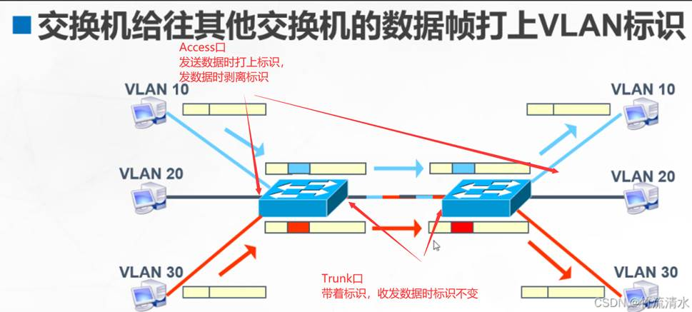

# 📝 网络设备与通信过程笔记
---

## 1. 基础概念  

### 1.1 交换机（Switch）是什么？  
交换机是一种工作在 **数据链路层（第二层）** 的网络设备，用于在局域网中根据 **MAC 地址** 转发数据帧，实现多个终端设备之间的高效通信。  

---

### 1.2 集线器（Hub）与交换机的区别  

| 比较项         | 集线器（Hub）                         | 交换机（Switch）                                   |
|----------------|--------------------------------------|---------------------------------------------------|
| **工作层级**   | 物理层（第一层）                      | 数据链路层（第二层）                               |
| **数据转发方式** | 广播：转发到所有端口                 | 点对点：根据 MAC 地址精确转发                      |
| **同时通信能力** | 不支持，易发生冲突                   | 支持多端口同时通信，避免冲突                        |
| **带宽利用**   | 所有端口共享带宽，效率低              | 每个端口独立带宽，转发更高效                        |
| **是否学习地址表** | ❌ 否                                | ✅ 是，自动学习并维护 MAC 地址表（CAM 表）          |

---

## 2. 设备通信过程详解  

### 2.1 通信前提  
- 主机A（`192.168.1.10`）需要与主机B（`192.168.1.20`）通信  
- 两者在同一 VLAN 中，通过交换机连接  
- 主机A已知主机B的 **IP 地址**，但不知道其 **MAC 地址**  

---

### 2.2 详细通信流程  

#### 步骤一：ARP 请求广播（寻找 MAC 地址）  
- 主机A需要封装以太网帧，但不知道B的 MAC  
- 于是发送 **ARP 请求广播帧**：  
  - 目标 MAC：`FF:FF:FF:FF:FF:FF`（广播地址）  
  - 内容：谁是 `192.168.1.20`？请告诉我你的 MAC！  

#### 步骤二：交换机“泛洪”广播帧  
- 交换机接收到广播帧，但无法在 MAC 表中找到目标 → 触发 **泛洪机制**  
- 将广播帧转发到除发送端口外的所有端口  
- 同时，交换机学习到：**主机A的 MAC 地址** 来自某个端口 → 加入 MAC 地址表  

#### 步骤三：主机B收到 ARP 请求并应答  
- 主机B识别 IP 地址匹配，回发 **ARP 响应帧**：  
  - 源 MAC：B 的 MAC 地址  
  - 目标 MAC：A 的 MAC 地址（单播）  

#### 步骤四：交换机学习 B 的 MAC 地址  
- 交换机收到 ARP 响应帧，学习到 **B 的 MAC** → 加入 MAC 地址表  
- 之后 A→B 的数据帧，交换机可直接点对点转发，不再广播  

#### 步骤五：主机A正式通信  
- 主机A将数据帧目标 MAC 设置为 **主机B的 MAC**  
- 交换机查表找到正确端口 → 完成 **高效点对点通信**  

---

### MAC 地址老化机制  
- 交换机维护的 MAC 地址表会定期老化  
- 默认老化时间约 **300 秒（5分钟）**  
- 若期间未收到对应 MAC 的流量 → 表项被移除，下次通信需重新泛洪学习  

---

## 3. 补充概念与注意事项  

### 3.1 交换机是否使用 IP 地址？  
- ❌ 普通二层交换机不处理 IP 地址，ARP 时只负责转发广播帧  
- ✅ 三层交换机才具备基于 IP 的转发能力（类似路由器）  

---

### 3.2 什么是“泛洪”？  
**泛洪（Flooding）**：交换机接收到某些帧（通常是广播或未知单播）时，将其复制并转发到所有端口的过程。  

---

### 3.3 广播的种类  

| 类型              | 描述                                                         |
|-------------------|--------------------------------------------------------------|
| **广播（Broadcast）** | 目的 MAC 全 F，例如 ARP 请求                               |
| **多播（Multicast）** | 目的 MAC 前缀为 `01:00:5e:xx:xx:xx`                        |
| **未知单播（Unknown Unicast）** | 目的 MAC 未知时，交换机临时广播（也称伪泛洪）     |

---

### 3.4 VLAN 与接口类型  
# Access 口与 Trunk 口总结笔记

## 1. 基础概念

### Access 口
- 一个端口只属于**一个 VLAN**。
- **进方向（PC → SW）**：交换机自动给帧打上 VLAN 标签。
- **出方向（SW → PC）**：交换机剥掉 VLAN 标签，PC 只看到普通以太网帧。
- **特点**：终端设备（PC、打印机等）对 VLAN 标签完全无感知。

### Trunk 口
- 一个端口可以承载**多个 VLAN**的流量。
- **进方向**：
  - 如果帧带标签，就按标签处理；
  - 如果没标签，则归属到该口的 **native VLAN**。
- **出方向**：
  - 通常保留 VLAN 标签（native VLAN 的帧可以配置成不打标签）。
- **常用于**：
  - 交换机与交换机之间的互联。
  - 交换机与路由器（单臂路由）。
  - 交换机与服务器（服务器网卡支持 VLAN Tag）。

## 2. 使用场景

### Access 口：一个 VLAN，对接终端
```
[PC]──(Access VLAN 10)──[Switch]
```
- **特点**：PC 不需要配置 VLAN，接到对应 VLAN 的端口就能通信。

### Trunk 口：多个 VLAN，对接网络设备
```
[SW1]──(Trunk VLAN 10,20,30)──[SW2]
```
- **特点**：一根链路承载多个 VLAN，节省物理接口。

## 3. 交换机之间互联
- 两台交换机互联时，一般配置为 **Trunk**。
- 两端的 Trunk 口允许的 VLAN ID 必须保持一致。
- VLAN 是靠 ID 区分的（名字只是说明用的），如果对端没有配置对应 VLAN ID，收到的帧会被丢弃。

## 4. 易混淆的点（重点✔）
- **PC 对 VLAN 标签无感知**：
  - PC 发出的帧没有标签，交换机在 Access 口进来时打标签，出 Access 口时剥标签。
- **Trunk 口之间不会剥离 VLAN 标签**：
  - VLAN10 的帧从 SW1 出 Trunk 口时带着 VLAN10 标签，SW2 收到后仍然识别为 VLAN10。
- **Access 口** = 一个 VLAN，不能同时属于多个 VLAN；如果要跑多个 VLAN，就必须用 **Trunk**。
- 交换机之间可以用 Access 口互联，但这样一条链路只能跑一个 VLAN，太浪费资源 → 实际中基本不用。
- 如果接口工作在 Trunk 模式，就要能识别 VLAN 标签。 比如： 

服务器：如果一块网卡同时跑多个 VLAN，就需要在网卡驱动里配置 VLAN Tag。这就是为啥在虚拟机平台创建虚拟机的时候要手动选择VLAN了

## 5. 一句话总结
- **Access**：一个 VLAN，终端接入。
- **Trunk**：多个 VLAN，设备互联。
- **应用场景**：交换机互联 → Trunk；终端接入 → Access。

- **Access 口**：连接终端设备（PC、服务器），仅属于一个 VLAN  
- **Trunk 口**：交换机间连接，可携带多个 VLAN 的数据帧  
- 主机本身无需关心 VLAN，仅交换机负责处理  

---
