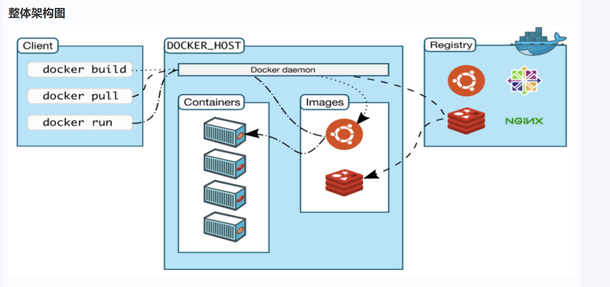
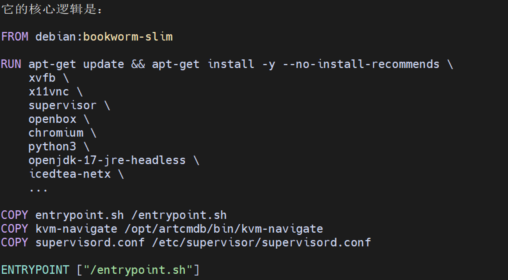
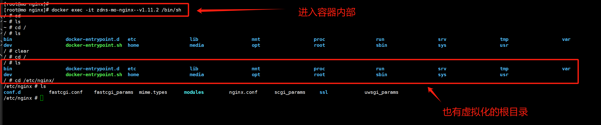

# Docker 基础：工作流、基本命令与核心概念

Docker 是容器化技术的代表，能高效打包、部署和运行应用。本文档从简单的工作流入手，介绍镜像（Image）、容器（Container）、常用docker命令，端口映射、卷（Volume）和 Dockerfile 等核心概念。

## 1. Docker 工作流概述



在安装了 docker 之后，运行的第一条 docker 命令大概率就是:
```
docker run hello-world
```
以这条命令为例，我们可以了解到，Docker的工作流如下所示：

1. **客户端联系守护进程**：客户端 将请求发送给后台 Docker daemon。
2. **拉取镜像**：daemon 从 Docker Hub(远端仓库) 下载 `hello-world` 镜像Image。
3. **创建容器**：基于镜像Image生成容器Container，运行容器内的可执行文件，产生输出（如 "Hello from Docker!"）。
4. **返回输出**：daemon 将结果流回客户端，显示在终端。

从上述工作流，可以看出docker最重要的概念就是围绕: Image，Container, daemon展开的

## 2. Dockerfile 和 镜像（Image）

### 2.1 Dockerfile

Docker_File 就是在将现有的程序，打包成镜像的时候，定义这个程序运行所需的文件系统，依赖的安装步骤，项目文件放置位置，以及容器启动时执行什么程序的说明文档。

说明文档就位后 docker build 根据说明书生成镜像，docker run 根据镜像启动容器
----
对于一个复杂的业务程序，比如说某个管理系统，为了运行管理系统，可能要ext4的文件系统，nginx,redis等中间件，各种库文件，为了保障业务程序能够正常运行，可能对依赖的版本和安装顺序均有要求，而这通常是 人工确认 为主，工具辅助为辅的。

因为 Docker并不需要知道这个项目的业务意图，也就不支持根据现有项目自动导入依赖
-----

以一个基础的 Dockerfile 为例


1)	FROM debian:bookworm-slim 是基础文件系统

首先要为运行的容器准备一份用户态的文件系统，里面也有 /bin/sh, /tmp/等相关目录，但是这个文件系统没有自己的kernel，所以容器启动的时候使用的还是宿主机的kernel (轻量化考量)

Bookworm-slim是 Debian官方Docker镜像的一个tag,
其中：
  - debian：镜像仓库名，默认从 Docker Hub 的官方 debian 仓库拉取
  - bookworm：Debian 12 的发行代号
  - slim：精简版，去掉了很多文档、工具、非必要包，比完整 Debian 镜像小

2) RUN apt-get install .. 把真实的依赖写进镜像层

使用Docker build命令的时候，会临时启动一个构建容器，在内部执行 apt-get install命令。这个时候，之前第一步的文件系统里面就多了项目所需的依赖

3) ENTRYPOINT 决定容器启动时运行什么

ENTRYPOINT ["/entrypoint.sh"], 当你执行：
```
docker run artcmdb/bmc-kvm
```
本质上就是 Docker 用这个镜像的文件系统启动了 /entrypoint.sh 这个进程。

4) 镜像是只读的，容器是在镜像上加一层可写层

根据上面的描写，大家对容器和镜像的关系理解可能就会更深一些
  - 只读层：Debian
  - 只读层：apt 安装的软件
  - 只读层：COPY 进去的项目文件
  - 可写层：当前容器运行期间产生的日志、临时文件、修改

镜像将应用及其依赖打包成只读模板，用于生成容器。同一镜像可创建多个容器。

### 2.2 镜像Image
通过Dockerfile, 将现有的项目打包成镜像后，接下来的操作就都简单了，针对镜像没啥好说的，主要就是一些常用命令。

- **列出镜像**：
  ```bash
  docker image ls
  ```
- **删除镜像**：
  ```bash
  docker image rm <imageName>
  ```
- **查看全部docker容器的元数据**
```bash
docker inspect [容器id]
```

## 3.容器（Container）

容器是镜像的可运行副本：
- 生成后，与镜像并存。
- 停止容器仅暂停其运行，但容器的数据还会保留；需手动删除释放空间。

### 3.1常用命令
- **列出运行容器**：
  ```bash
  docker container ls
  # 或旧版简写
  docker ps
  ```
  - `docker ps` 源于 Linux `ps` 命令，现保留兼容。

- **列出所有容器**：
  ```bash
  docker container ls -a
  # 或
  docker ps -a
  ```

- **删除容器**：
  ```bash
  docker container rm <containerID>
  ```
  - 停止后删除释放名称和空间。

### 3.2 容器内部路径与隔离

容器文件系统与主机隔离：还是从Dockerfile可以明白，容器的文件系统来自于镜像，而镜像里面的镜像使用的文件系统是自己From出来的。

因为文件系统是隔离的，因此容器和主机之前互通数据，是通过端口映射达成的

## 端口映射（Port Mapping）

容器端口与主机隔离。**暴露端口**（Expose）指通过映射让容器服务（如 nginx:8080）可被主机/外部访问。

### 暴露概念对比

| 术语                  | 含义                                      | 外部访问 |
|-----------------------|-------------------------------------------|----------|
| EXPOSE（Dockerfile） | 声明服务端口（提示用）                    | ❌      |
| -p（run 参数）       | 映射容器端口到主机端口                    | ✅      |
| 容器内监听端口       | 仅容器内部访问                            | ✅      |

### 示例：Nginx 部署

假设 nginx.conf：
```nginx
listen 8080;
```

运行：
```bash
docker run -d --name mynginx -p 8080:8080 nginx
```

- **格式**：`-p <主机端口>:<容器端口>`
- **效果**：
  - 容器内：nginx 监听 8080。
  - 主机：`http://localhost:8080` 访问。
  - 外部：若防火墙允许，访问主机 8080 转发至容器。

| 格式                  | 含义                          |
|-----------------------|-------------------------------|
| 主机端口:容器端口    | 主机 8080 → 容器 8080        |

### 查看映射
- **docker ps**：
  ```bash
  docker ps
  ```
  示例：
  ```
  CONTAINER ID   IMAGE   COMMAND   PORTS               NAMES
  f3b1a6f8d2ab   nginx   ...       0.0.0.0:8080->8080/tcp   mynginx
  ```

- **docker port**：
  ```bash
  docker port mynginx
  ```
  输出：`8080/tcp -> 0.0.0.0:8080`

- **主机工具**：
  ```bash
  ss -tnlp | grep 8080
  # 或
  netstat -tnlp | grep 8080
  ```
  可见 `docker-proxy` 或 `containerd-shim` 监听。

### 无映射后果
```bash
docker run -d nginx
```
- 容器内 nginx 监听 8080，但主机无法访问。
- 测试：`docker exec -it nginx curl localhost:8080`

### 小结
| 概念          | 作用                    | 外部访问 |
|---------------|-------------------------|----------|
| EXPOSE 8080  | Dockerfile 声明提示    | ❌      |
| -p 8080:8080 | 实际主机-容器映射      | ✅      |
| docker ps    | 查看映射关系            | ✅      |

**总结**：容器端口内部化；`-p` 映射至主机，实现外部访问。

### 端口映射自动化
映射需显式指定，否则仅内部访问。

示例：
```bash
docker run -d -p 8080:80 nginx
```
- 主机 8080 → 容器 80。

#### 自动化方式
1. **Dockerfile + -P**：
   ```dockerfile
   FROM nginx
   EXPOSE 80 443
   ```
   ```bash
   docker run -P <image>
   ```
   - 自动分配随机主机端口（如 49153→80）。

2. **docker-compose.yml**（推荐企业部署）：
   ```yaml
   services:
     nginx:
       image: nginx
       ports:
         - "8080:80"
         - "443:443"
   ```
   ```bash
   docker compose up -d
   ```
   - 自动化端口、卷、环境变量。


----
 **进入容器**：
   ```bash
   docker exec -it <containerName> bash
   ```
   - `-i`：交互模式；`-t`：伪终端。
   - 若无 `bash`，用 `/bin/sh`。



### 容器生命周期命令
- **启动停止容器**：
  ```bash
  docker container start <containerID>
  docker container stop <containerID>  # 发送 SIGTERM，优雅关闭
  docker container kill <containerID>  # 发送 SIGKILL，强制终止
  ```
  - `run` 创建新容器；`start` 复用现有。

- **查看日志**：
  ```bash
  docker container logs <containerID>
  ```
  - 用于调试崩溃容器。

## 卷（Volume）：数据持久化

容器文件系统临时：删除容器丢失数据。**卷** 如外置硬盘，独立于容器生命周期。

- **创建与挂载**：
  ```bash
  docker volume create mydata
  docker container run -v mydata:/app nginx
  ```
- 适用于数据库、日志等持久数据。

## Docker 命令速查表（Cheat Sheet）

| 类别     | 命令示例                          | 描述                  |
|----------|-----------------------------------|-----------------------|
| 镜像    | `docker image ls`<br>`docker image rm <name>` | 列出/删除镜像        |
| 容器    | `docker ps`<br>`docker ps -a`     | 运行/所有容器        |
| 运行    | `docker run -d -p 80:80 <image>`  | 后台运行，端口映射   |
| 管理    | `docker start/stop/kill <id>`     | 启动/停止/终止       |
| 日志/进入| `docker logs <id>`<br>`docker exec -it <id> bash` | 查看日志/进入容器    |
| 卷      | `docker volume create <name>`     | 创建卷                |

推荐 [Docker 官方 Cheat Sheet](https://docs.docker.com/engine/reference/commandline/cli/)，打印备用。

---

