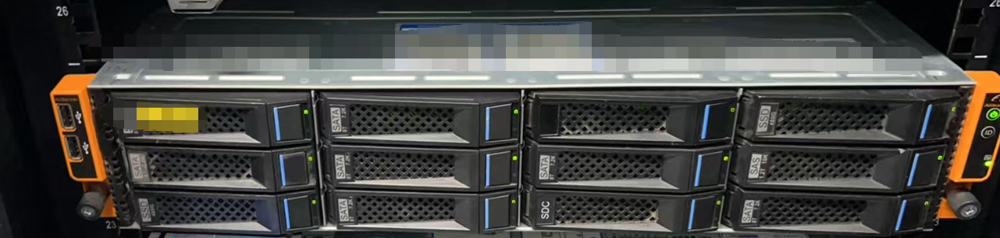
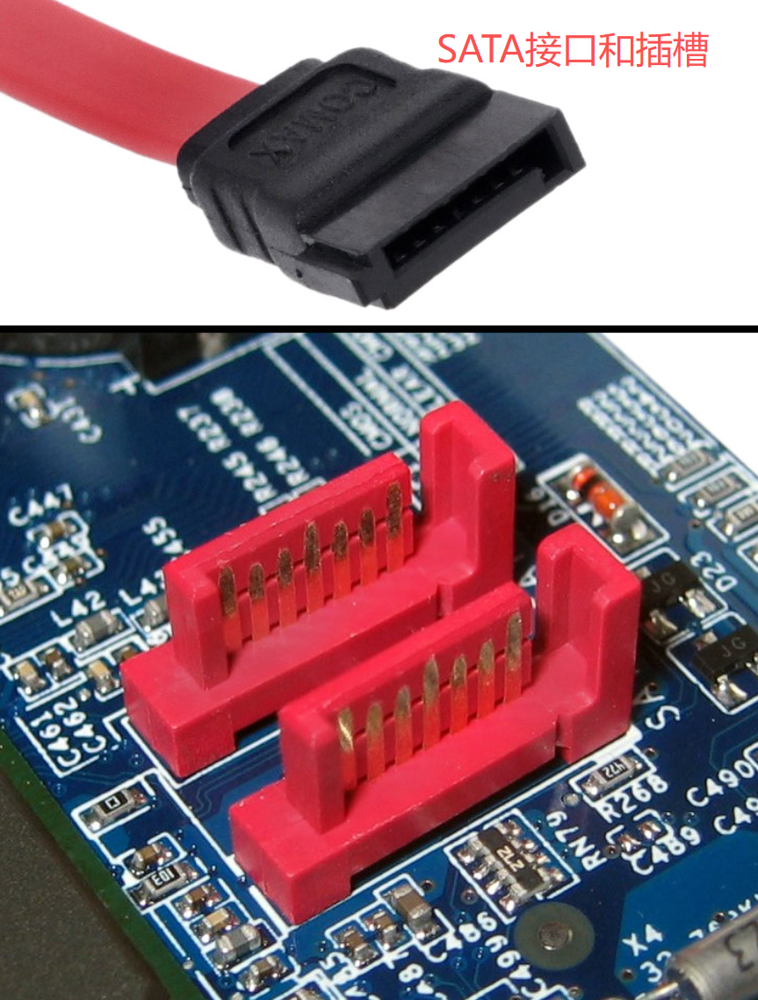
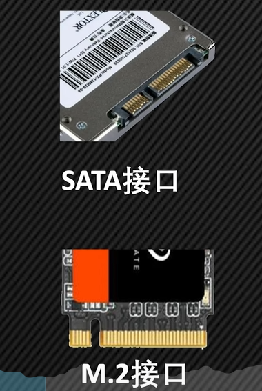
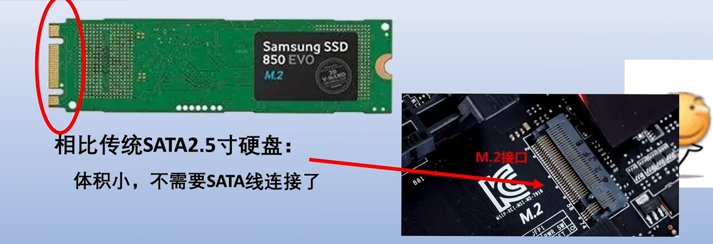
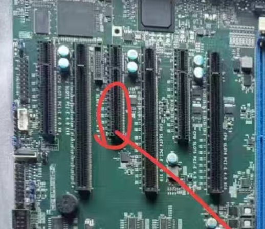
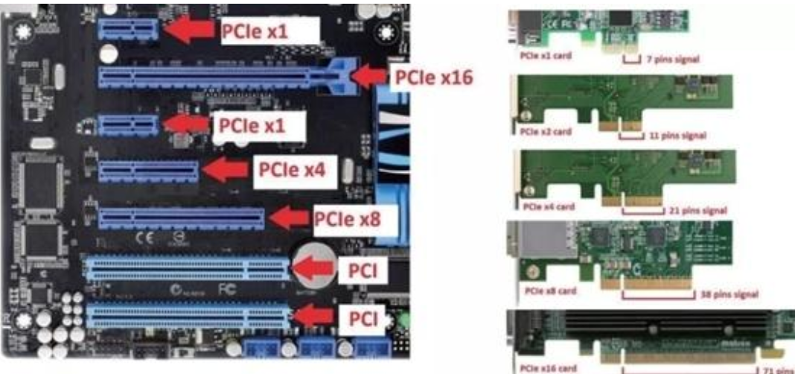
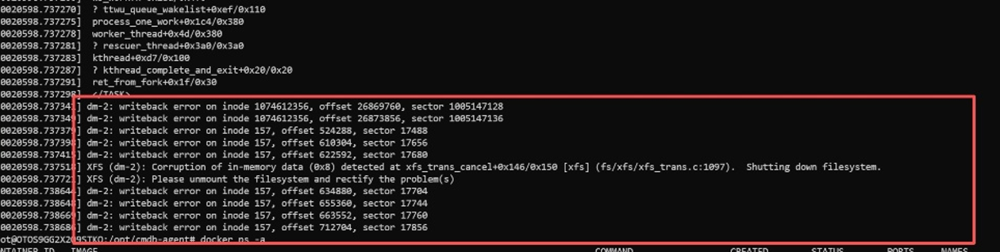

# Linux 硬盘完整指南

硬盘是接触服务器的工作中，我认为接触最多的硬件了，并且硬盘里面关于: **"逻辑卷(LVM)、卷组(VG)、Docker Volume 和挂载点"** 等概念，理解起来还是有点难度的。

下面是我在日常工作中，学习和掌握的内容。

## 1.硬盘的物理特性
这是硬盘的照片，更加具体来说，是从机架上看到的，正插在服务器的正面工作的硬盘.



机房里的服务器，会区分其正反面，正面是露出硬盘的部分，反面就是拔插网线的部分。

因为硬盘属于易耗品，需要频繁的更换(都支持热拔插)，因此设计在正面，我们可以通过拨杆开关即可弹出.

### 1.1 常见的服务器硬盘分类

- SATA硬盘: 可以等同于机械硬盘(HDD), 需要通过SATA线连接到主板的插槽上，便宜和量大管饱是其最大的优点，但与之相对的就是IO速度在现在不够看了。
- SAS硬盘: 更加高级一点的机械硬盘，但是好像都没怎么在工作中见过。
- SSD硬盘: 基于 闪存存储技术 的硬盘，也就是我们常说的固态，更快的IO带来更贵的售价。
- NVME硬盘: 基于PCIe接口的, 一般都是跑CDN服务器才会上这么好的配置，贵的不得了

### 1.2 SATA、M.2、PCIE接口 

SATA 接口是(正在逐渐走向没落的硬盘接口),但没落速度就像IPV6取代IPV4一样，所以还是有必要花时间了解一下的


串行ATA（英语：Serial ATA，全称：Serial Advanced Technology Attachment，又称SATA）是一种电脑总线，负责主板和大容量存储设备（如硬盘及光盘驱动器）之间的数据传输，主要用于个人电脑。串行ATA与串列SCSI（SAS: Serial Attached SCSI）的两者排线兼容，SATA硬盘可接上SAS接口。

M.2接口

M.2接口就是我们常说的固态硬盘的接口，M.2既可以支持SATA，也可以支持NVME协议。



不过再继续说M.2接口之前，大家可以注意到，SATA接口分为*宽的* 和*窄的*的两部分，
- 窄的那一段（7 pin）： 数据传输接口。
- 宽的那一段（15 pin）： 电源供电接口。
所以使用起来就很麻烦，还要使用SATA线才能连接到主板上


而M.2 接口也分成了两段（甚至三段），但这不是为了区分数据和电源，而是为了**“防呆”和区分协议**。这些缺口被称为 Key（键位）。

- B Key（左侧缺口）： 这种接口通常支持 SATA 协议或较慢的 PCIe x2 协议。
- M Key（右侧缺口）： 这种接口通常支持高性能的 NVMe 协议（PCIe x4）。
- B&M Key（两个缺口）： 这种硬盘兼容性最强，既能插在 B Key 插槽也能插在 M Key 插槽，但通常也是走 SATA 协议。

而M.2接口可以直接插主板的M.2插槽处，就不用接SATA线了，省距离了


PCIE接口



PCIE接口连接的是计算机里面的高速总线，可以直接和CPU连接，体验到极致的IO速度，并且该接口也可以插硬盘，显卡，声卡等一堆东西。

为什么PCIe有不同的长度？

PCIe接口的总线带宽是按长度划分的PCIe X1、PCIe X2、PCIe X4、PCIe X8、PCIe X16。虽然我们可以把任意长度的PCIe设备插到PCIe X1或者PCIe X16的插槽中去运行，但是这样很明显会造成一个问题，带宽要求小的设备会浪费PCIe X16的超大带宽，而带宽要求大的设备在PCIe X1插槽内又“吃不饱”。



## 2.使用smartctl命令
当硬盘被正确安装并使用后，为了判断硬盘是否又在正常使用，或者有时候我们想确认一下硬盘的性能参数，用的最多的就是smartctl命令

首先要确保的是使用这条命令是需要 root 权限的，对于使用 SATA/SAS/NVME 硬盘，可以直接使用
```
smartctl -a /dev/sda
```
来查看硬盘现在的情况，

并且可以执行这条命令后，系统会刷出一大堆输出，不过我们主要看的内容是这些

- Reallocated_Sector_Ct   重映射扇区计数。 硬盘发现坏道后，用备用扇区替换的次数。如果这个值持续增长，硬盘离报废不远了。
- Reported_Uncorrectable_Errors  无法恢复的错误, 硬件无法修复的读取错误，值大于 0 通常意味着数据完整性面临风险。
- Current_Pending_Sector   待处理扇区，“疑似坏道”，正在等待重新测试。
- Offline_Uncorrectable    离线无法校正错误， 读写表面有物理损坏。
- Power_On_Hours           通电时间，评估硬盘寿命背景


## 3.硬盘在Linux和Windows的区别

### 3.1 Linux 和 Windows 的硬盘本质差异

| 特性 | Windows | Linux |
|------|---------|-------|
| 盘符 | C:、D:、E: 等多个根 | 只有一个根：/ |
| 硬盘使用 | 插进去格式化直接用 | 需要 LVM 初始化后才能用 |
| 灵活性 | 固定分配 | 可在线扩容 |
| 多盘合并 | 困难，需第三方工具 | 原生支持（VG 池化） |

Linux万物皆文件，都要挂载 / 下面，刚开始是不太习惯的，但是之后越用越发现这个理念太伟大了。

---
## 4.Linux系统下的硬盘

### 4.1 LVM 是什么？

**LVM（Logical Volume Manager）** 是 Linux 的逻辑卷管理系统，让硬盘管理变得灵活高效。

它通过三层抽象，把 PV → VG → LV 组织起来：

| 名称 | 英文全称 | 对标现实 | 作用 | 命令查看 |
|------|---------|---------|------|---------|
| **PV** | Physical Volume 物理卷 | 一块块真实硬盘/分区 | Linux 能"看到"的最原始资源 | `pvs`、`pvdisplay`、`lsblk` |
| **VG** | Volume Group 卷组 | 把多块硬盘汇到大水池 | 融合多个 PV 的空间，形成统一资源池 | `vgs`、`vgdisplay` |
| **LV** | Logical Volume 逻辑卷 | 从水池里分配一块区域 | 真正的"虚拟分区"，可以格式化、挂载、使用 | `lvs`、`lvdisplay` |


```伪代码的方式进行理解
多块硬盘（PV）
   ↓ (pvcreate)
   ↓
一个水池（VG）
   ↓ (lvcreate)
   ↓
虚拟分区（LV）← 系统能直接用
```

---

## 5. LV的常见路径写法
就像我们使用Windows系统一样，硬盘分LVM、挂载的操作基本都是安装操作系统的时候完成，之后就很少会进行更改了

### 5.1 LV 的两种标准路径格式

```bash
/dev/[VG名称]/root          ← 字符映射方式
/dev/mapper/VolGroup-root   ← 设备映射方式, 这种方式显示的就是所谓dm-x
```

这两个实际上是**符号链接**，都指向同一个逻辑卷。

### 不同OS的默认命名(科普)

| 操作系统 | 卷组名（VG） | 根逻辑卷（LV）路径 | 设备路径 | 文件系统 |
|---------|-----------|------------------|---------|---------|
| CentOS 7 | VolGroup | /dev/VolGroup/root | /dev/mapper/VolGroup-root | xfs |
| CentOS 8/9、Rocky | centos | /dev/centos/root | /dev/mapper/centos-root | xfs |
| RHEL 8/9 | rl | /dev/rl/root | /dev/mapper/rl-root | xfs |
| Ubuntu | ubuntu-vg | /dev/ubuntu-vg/ubuntu-lv | /dev/mapper/ubuntu--vg-ubuntu--lv | ext4 |

---

## 6. 挂载的概念

### 6.1 为什么要挂载？
不像 Windows 有多个盘符（C:、D:、E:），Linux **只有一棵目录树**：就是 / 根目录

在 Linux 里：**所有存储设备必须"挂载"到某个目录，才能被访问**. 就因为这个理念，所有的硬件设备，插到服务器后，就必须要挂载到文件系统里面，这样Linux才能操作它，反正，如果不挂载，那么OS就不能使用。比如说一块裸盘插入机器后，可以使用 lsblk 看到有这块盘，但因为还没有将其挂载到文件系统下，用户也就无法操作它。

```Linux的目录树
/
├── etc
├── home
├── data        ← 这个目录可以挂载硬盘
└── var
```

### 6.2 挂载硬件到底发生了什么？

假设你有块裸盘，插进机器后，只要你的硬件连接是成功的，内核识别到了驱动，它就会在 /dev/ 下为这块硬盘创建一个设备文件`/dev/sdb1`，但此时机器严格意义上还没有挂载成功，因为这块硬盘既没有初始化文件系统，也还没有正式挂载到目录树下。


## 7. Docker Volume 和硬盘的关系

### 7.1 Docker Volume 是什么？

Docker Volume 本质上很简单：

> **容器直接挂载到某个目录下，让容器数据不会随着容器销毁而消失**

| 特性 | 说明 |
|------|------|
| 挂载对象 | 目录，不是设备 |
| 数据持久化 | 容器删了，数据还在宿主机 |
| 存储路径 | 可以是硬盘、LVM、NFS 等任何地方 |

### 7.2 查看docker容器对应的Volume
```
docker inspect [容器ID] | grep -A 5 Mounts (不加grep也行)
```

### 7.3 Docker容器也可以直接挂载到目录树上

假设场景：

1. 有一块新硬盘 `/dev/sdb`
2. 想让 Docker 容器数据存在这块硬盘上

完整步骤：

```bash
# 第1步：初始化硬盘，创建 LVM 逻辑卷
pvcreate /dev/sdb
vgcreate vg_docker /dev/sdb
lvcreate -L 500G -n lv_docker vg_docker
mkfs.xfs /dev/vg_docker/lv_docker

# 第2步：把逻辑卷挂载到宿主机的某个目录
mkdir -p /data/docker-volumes
mount /dev/vg_docker/lv_docker /data/docker-volumes

# 第3步：让 Docker 使用这个目录
docker run -d \
  -v /data/docker-volumes:/app/data \
  --name my-app \
  nginx

# 第4步（可选）：永久挂载
echo "/dev/vg_docker/lv_docker /data/docker-volumes xfs defaults 0 0" >> /etc/fstab
```

## 8. 实操裸盘


一块真实硬盘插入 Linux 系统时：
```bash
lsblk              # 会看到新盘，比如 /dev/sdb
```

但此时这块盘**还不能用**，因为：
- ❌ 没有被识别为物理卷（PV）
- ❌ 没有加入任何卷组（VG）
- ❌ 没有文件系统，系统不知道怎么读取

### 8.1 硬盘初始化的完整步骤

```bash
# 1. 确认新硬盘被识别
lsblk

# 2. 给硬盘分区（写入分区表）
fdisk /dev/sdb

# 3. 创建物理卷（PV）- 这是 LVM 的第一步
pvcreate /dev/sdb1

# 4. 加入或创建卷组（VG）
vgextend VolGroup /dev/sdb1   # 加入现有 VG
# 或
vgcreate vg_data /dev/sdb1    # 创建新 VG

# 5. 从 VG 中创建逻辑卷（LV）
lvcreate -L 500G -n lv_data(逻辑卷的名字) vg_data(卷组的名字)

# 6. 创建文件系统
mkfs.xfs /dev/vg_data/lv_data
# 或
mkfs.ext4 /dev/vg_data/lv_data

# 7. 挂载到目录树
mount /dev/vg_data/lv_data /data

# 8. (可选) 永久挂载，编辑 /etc/fstab
echo "/dev/vg_data/lv_data /data xfs defaults 0 0" >> /etc/fstab
```

在第七步的时候，当这块已经初始化文件系统的硬盘挂载到目录树上后，我们就可以通过直接操作 /dev/vg_data/lv_data 这个路径，来对硬盘进行增删改查的操作了


## 8.2 在线扩容

根分区满了，新插了一块硬盘（/dev/sdb），想把这块新盘空间加到根分区。

```bash
# 第一步：确认新硬盘
lsblk
# 看到 /dev/sdb 500G disk

# 第二步：分区
echo -e "n\np\n1\n\n\nt\n8e\nw" | fdisk /dev/sdb

# 第三步：创建物理卷
pvcreate /dev/sdb1

# 第四步：查看当前卷组名（重要！）
vgs
# 输出类似：VolGroup、centos、cl 等

# 第五步：把新 PV 加到现有 VG
vgextend VolGroup /dev/sdb1
# 把 VolGroup 改成你自己的卷组名

# 第六步：查看新增的可用空间
vgdisplay VolGroup

# 第七步：扩展逻辑卷（用全部剩余空间）
lvextend -l +100%FREE /dev/VolGroup/root
# 或其他命名方式：
# lvextend -l +100%FREE /dev/centos/root
# lvextend -l +100%FREE /dev/cl/root

# 第八步：扩展文件系统（这才是真正生效的一步）

# 如果是 xfs（现代系统通常是这个）
xfs_growfs /                          # 注意：挂载点是 /，不是设备名！

# 如果是 ext4（老系统）
resize2fs /dev/VolGroup/root

df -h /
lsblk
```

---

### 9. 硬盘故障后的排查

一般硬盘出了问题，都会将对应的报错打印到内核日志上，大家就可以通过

```
dmesge 
journal -k 来查看
```

比如我最近发现某台机器的带宽有问题，就是因为有磁盘坏了，对应系统的磁盘IO不足，单位时间内缓冲队列里面的数据发不出去，下一波数据九八缓冲队列的清掉了，造成了丢包

当我查看最新的内核日志的时候，果然发现又盘坏掉了，这里显示:
   * Writeback error on inode xxx;   说明往磁盘里面的扇区 xx 写数据失败了
   * Xfs： Corruption of in-memory –> 说明内存里面的文件系统元数据损坏了，为了避免把损坏的数据写进磁盘造成更大的损失，主动触发了保护机制，让文件系统只读了
