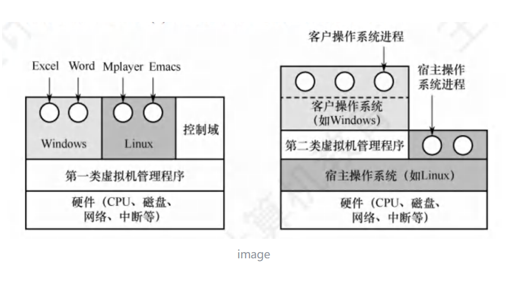

# KVM

这里面的KVM指的不是BMC操作界面的KVM，而是最基础的虚拟化技术，全称是 Kernel-based Virtual Machine; 并且是开源的，它是 Linux 内核的一个模块，可以让Linux系统变成一个虚拟机控制器(Hypervisor).

KVM属于Type-1类型的虚拟化技术，可直接运行在硬件上，虚拟机的性能接近物理机。相比之下，VMware workstation 这些Type-2的虚拟化 需要先在宿主机的操作系统商运行

## Type-1 和 Type-2的区别
虚拟机的基本组件包括: 
    - 虚拟化层: 提供抽象硬件功能的接口
    - 虚拟硬件: 包括虚拟化 CPU、内存、存储和网络
    - 客户操作系统： 运行在虚拟硬件上的操作系统

KVM, QEMU, libvirt

① 查看所有虚拟机及其运行状态
virsh list --all

② 查看虚拟机的详细配置（CPU、内存、磁盘、网卡等）
virsh dominfo <虚拟机名称>

③ 获取虚拟机的 IP 地址
virsh domifaddr <虚拟机名称>

④ 查看虚拟机的磁盘文件位置
virsh domblklist <虚拟机名称>

① 检查生命周期与开机状态
virsh start <虚拟机名称>

① 从宿主机进入虚拟机
virsh console <虚拟机名称>
