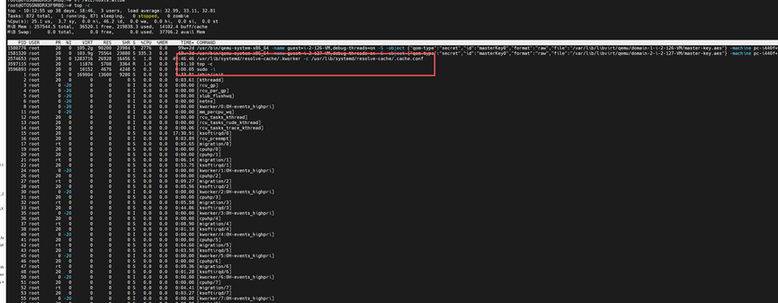

最近工作中我的一批虚拟机被黑了，原因是新人使用AI做虚拟化的时候，AI生成了弱密码，debian/debian了。

我也没仔细检查，后来被老大看到有机器的CPU占用率有问题，登录上去后 top -c 就发现被黑了，就像这样

也是非常常见的挖矿程序，kwork进程出现的很频繁，所以很容易被用户发现，但真正的kworker进程的PPID是2，并且也不是 .kworker, 见过一次之后还挺好辨认的。
