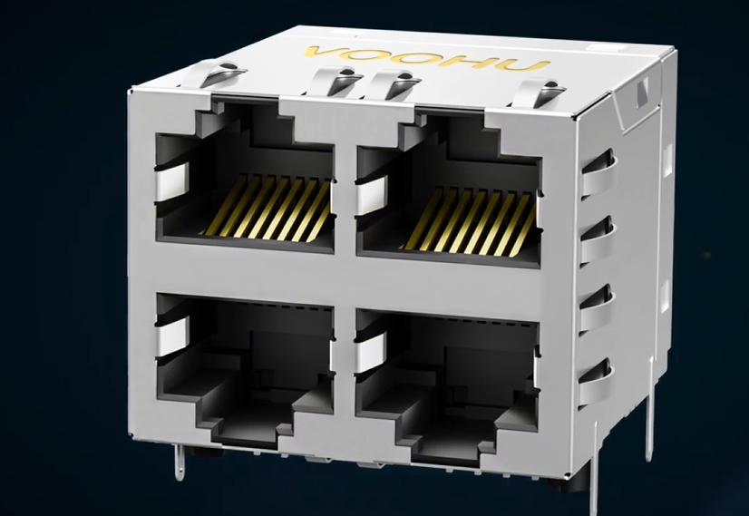
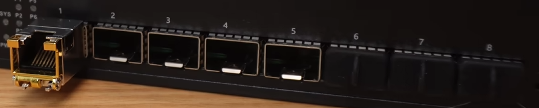
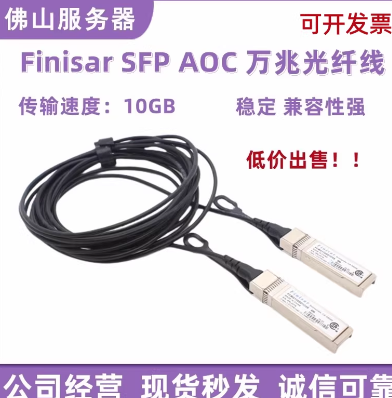

## 1. ethtool - 网卡信息查看

### 1.1. 查看网卡详细信息：
```bash
ethtool ethX(网卡名称)
```

```可能的输出
Settings for ens35f1np1:
        Supported ports: [ FIBRE ]
        Supported link modes:   1000baseT/Full
        Supported pause frame use: Symmetric
        Supports auto-negotiation: Yes
        Supported FEC modes: None        RS      BASER
        Advertised link modes:  1000baseT/Full
        Advertised pause frame use: Symmetric
        Advertised auto-negotiation: Yes
        Advertised FEC modes: RS
        Speed: 25000Mb/s              # 该网卡最多可以跑25G的带宽
        Duplex: Full                  # 全双工还是半双工
        Auto-negotiation: on          # 自协商是否开启，如果对端交换机强制指定了速率
        Port: FIBRE
        PHYAD: 0
        Transceiver: internal
        Supports Wake-on: g
        Wake-on: g
        Current message level: 0x00000004 (4)
                               link
        Link detected: yes   # 查看物理链路是否连通，排除网线/光纤没插好、对端交换机端口关闭
```

### 1.2. 查看网卡的驱动和固件版本
该命令经常用作排查驱动兼容性问题
```
ethtool -i ethX(网卡名称)
```

```预期的输出
driver: mlx5_core
version: 6.1.0-41-amd64
firmware-version: 14.20.1010 (MT_2470112034)
expansion-rom-version: 
bus-info: 0000:3b:00.1
supports-statistics: yes
supports-test: yes
supports-eeprom-access: no
supports-register-dump: no
supports-priv-flags: yes
```

### 1.3. 查看网卡是否丢包（错误率、丢包情况）：
```bash
ethtool -S ethX | grep errors
```

该命令主要是从物理层，查看是否存在电磁干扰，光纤损耗等造成的丢包或错误率

```预期输出
     rx_crc_errors_phy: 0
     rx_in_range_len_errors_phy: 0
     tx_errors_phy: 0
```

### 1.4. 查看光模块内部的微处理器信
```
ethtool -m ens35f1np1
```

```预期输出
        Vendor name                               : MODULETEK       # 模块品牌
        Vendor PN                                 : AOC-SFP-25G-5M  # 注意 AOC 字样。这代表这是一根 有源光缆 (Active Optical Cable)，即两头的光模块和中间的光纤是一体化集成的。
        Laser output power                        : 0.8205 mW / -0.86 dBm       # 网卡发出的光强度
        Receiver signal average optical power     : 0.8056 mW / -0.94 dBm       # 网卡接收到的光强度 | 如果 RX 比 TX 小很多（比如差了 10 dBm 以上），说明光纤链路损耗很大，或者是光头脏了
```


## 2. S.M.A.R.T 硬盘检测工具

**工具说明：**

`smartctl` 是 Linux/Unix 系统下最强大的硬盘健康检测工具。全称为 S.M.A.R.T. Control，专门用来读取硬盘驱动器内置的 S.M.A.R.T.（自我监控、分析及报告技术）数据。支持几乎所有现代类型的硬盘，包括 SSD、NVMe 和 HDD，但由于技术架构不同，表现形式和参数会有所区别。

**常用命令：**

### 2.1. **查看硬盘基本信息**（型号、序列号、是否支持 SMART）
```bash
smartctl -i /dev/nvme0n1     # NVMe SSD
smartctl -i /dev/sda         # SATA HDD/SSD
```

### 2.2. **查看详细健康报告**（最常用）
```bash
smartctl -a /dev/sda         # SATA SSD/HDD
smartctl -a /dev/nvme0n1     # NVMe SSD
```

### 2.3. **查整体健康状态**
```bash
smartctl -H /dev/sda
```

**重要注意事项：**
- `smartctl` 需要 root 权限才能直接访问硬件寄存器
- 在云服务器或虚拟机（如 Docker、VM）中，通常无法直接使用 `smartctl`，因为它看到的是虚拟磁盘，而不是底层物理硬件

---
## IPMI_tool 命令

只要能够连接到目标服务器的IPMI的IP地址，即使不等于对方的BMC管理平台，不开KVM，也可以通过ipmitool命令的方式，远程对服务器进行调整

  # 设置一次性从 PXE 启动（下次开机生效一次）
  ipmitool -I lanplus -H 10.104.0.177 -U ADMIN -P <密码> chassis bootdev pxe

  # 或者持久化
  ipmitool -I lanplus -H 10.104.0.177 -U ADMIN -P <密码> chassis bootdev pxe options=persistent

  # 重启服务器
  ipmitool -I lanplus -H 10.104.0.177 -U ADMIN -P <密码> chassis power reset

  # 检查电源/启动状态
  ipmitool -I lanplus -H 10.104.0.177 -U ADMIN -P <密码> chassis bootparam get 5

---
## 3.系统状态切换

```bash
init 0    # 关机
init 1    # 单用户模式（救援模式）
init 6    # 重启
```

## 4.SSH 密钥认证

在本机生成SSH密钥对，并将公钥添加到远程仓库的账户设置中，以便进行安全的身份验证。
```生成SSH密钥对
ssh-keygen -t ed25519 -C "你的邮箱@example.com"
# 如果系统不支持ed25519算法，可以使用RSA算法
ssh-keygen -t rsa -b 4096 -C "你的邮箱@example.com"
```

生成的密钥对通常会保存在用户主目录下的`.ssh`文件夹
```查看刚刚生成的公钥
cat ~/.ssh/id_ed25519.pub
# 或者
cat ~/.ssh/id_rsa.pub
```

登录到目标机器上，把自己的公钥复制到对应主机的~/.ssh/authorized_keys里面即可

---

## 5. 服务器的耗材

### 5.1 光模块(Transceiver)
看中文摸不清头脑，看英文就一目了然了，因为服务器内部处理的是电信号，而机房骨干网传输通常用的是光信号。光模块的作用就是把这两者互相转换。

### 5.2 服务器后端的口分为 电口 和 光口：

- 电口(RJ45): 和家里的路由器接口一样(8脚)，自带转换电路，一般都是插普通的网线。 因为电信号在铜线里传输距离短（通常不超过 100 米），且容易受到电磁干扰，所以一般用来在机房内部通信。


- 光口（SFP+/SFP28 等）： 它本身只是一个“空壳子”,主要是为了方便，想要用电口就插"电模块"; 要想使用光口就要插光模块:


顺带一提，光模块长这个样子，金手指的一端插服务器里面，


### 5.3 DAC(Direct Attach Cable)


直接附连电缆,它把“两个光模块”和“一根线”做成了一个整体, 需要额外注意的是：
    - 这玩意传输的是电信号，虽然它插在光口（SFP28）里，但中间那根黑色的线里面是铜线
    - 这玩意是一体的，不可以拆开用
之所以这样设置，主要就是因为便宜，它兼具了光纤的传输速度，又便宜，非常适合在机房里面连接服务器和交换机，在机房里面一般插带外的管理口的。

让我们来看一个交付场景中的DAC耗材说明
```
Proline DAC-SFP-25G-3M-PRO25GBase-CU directattach cable TAACompliant 9.84ft
```

| 参数项          | 含义         | 实际影响                                                                 |
|-----------------|--------------|--------------------------------------------------------------------------|
| 25G             | 速率         | 匹配你之前看到的 ens35f1np1 网卡速率（25Gbps）                           |
| SFP             | 接口类型     | 这种规格的头正好插进你图中看到的那些长方形光口                           |
| 3M / 9.84ft     | 长度         | 这根线长 3米。这在 DAC 中算比较长的，通常用于同机柜内服务器连交换机     |
| CU (Copper)     | 材质         | 明确标注了里面是铜芯                                                     |
| TAA Compliant   | 合规性       | 贸易协定法案合规，通常是针对海外（如美国）政府采购的限制要求             |


### 5.4 AOC(Active Optical Cable)
有源光缆，它和 DAC 一样，两头的“模块”和中间的“线”是焊死连在一起的，不能拆开，最大的区别在于它跑的是光纤信号，所以用来跑带内的业务数据

让我们来看一个交付场景中的AOC耗材说明
```
Proline DAC-SFP-25G-3M-PRO25GBase-CU directattach cable TAACompliant 9.84ft
```
| **参数项**       | **含义**               | **实际影响**                                           |
|------------------|------------------------|--------------------------------------------------------|
| Arista品牌       | 这是一个著名的网络设备厂商（类似思科/华为） | 说明这是 Arista 原厂或兼容 Arista 设备的线缆，品质和兼容性更有保障 |
| 25G              | 速率                   | 完美匹配你之前 ethtool 查到的网卡速度                  |
| 3M               | 长度                   | 3 米长，适合跨机柜或者在机柜内灵活布线                |
| Active Optical   | 介质                   | 内部是光纤，比铜线更轻、更细                           |

### 可以再具体一点
- DAC (黑色粗线)：适合同机柜（服务器连顶上的交换机），最便宜，但很重。
- AOC (彩色/黑色细线)：适合同机柜或相邻机柜，轻便、不干扰信号，价格中等