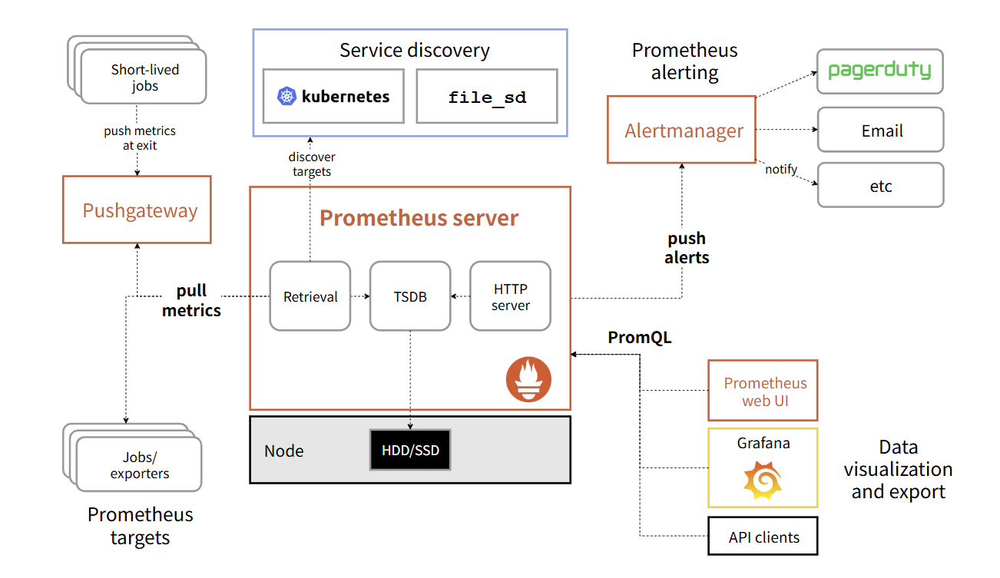

## 概述



Prometheus  是一个开源系统监控和告警工具包，于 2016 年加入了 云原生计算基金会 ，作为继 Kubernetes  之后的第二个托管项目。该工具部署起来非常简单，整体服务都是用Go写的，可以直接下载对应的二进制文件独立运行，不需要任何外部依赖，太轻量化和方便了！

Prometheus 将对应的监控数据以时序数据库的形式存储(TSDB,也就是键值对那一套)，熟悉VictraMetrice数据库的会很熟悉: 指标，时间戳，标签这些。

Prometheus另一个比较有趣的例子就是，在待监测服务器内部打桩(安装agent)之后，该机器的监测数据都是存在服务器本地的(这也是分布式存储)，然后管理平台直接或通过中间Pushgateway(中间网关), 从已经打桩的服务器中抓取指标。然后，管理平台在本地存储所有抓取的指标，再对这些指标运行告警检查啥的，并可以使用 Grafana 来将收集到的数据可视化。

当然也可以把打桩机器上采集到的数据外发出去，到别的时序数据库里面，扩展性也很强

## 特性
Prometheus 的主要特性包括
    • 多维 数据模型，其时间序列数据由指标名称和键/值对标识
    • PromQL，一种 灵活的查询语言，用以发挥这种多维度的优势
    • 分布式存储；单个服务器节点是自治的
    • 时间序列数据采集通过基于 HTTP 的拉取（Pull）模型进行
    • 通过中间网关支持 推送时间序列数据
    • 通过服务发现或静态配置来发现目标
    • 支持多种图形和仪表板展示模式

## Prometheus的基础配置
``` scrap.yml的抓取配置
global:
  scrape_interval:     15s
  evaluation_interval: 15s

rule_files:
  # - "first.rules"
  # - "second.rules"

scrape_configs:
  - job_name: prometheus
    static_configs:
      - targets: ['localhost:9090']
```

示例配置文件中有三个配置块：global、rule_files 和 scrape_configs。

global 块控制 Prometheus 服务器的全局配置:
    -  scrape_interval，它控制 Prometheus 抓取目标的频率。可以为单个目标覆盖此设置。在此示例中，全局设置是每 15 秒抓取一次。
    - evaluation_interval 选项控制 Prometheus 评估规则的频率。Prometheus 使用规则来创建新的时间序列并生成告警。

rule_files 块指定了我们希望 Prometheus 服务器加载的任何规则的位置。目前我们还没有规则。

scrape_configs，它控制 Prometheus 监控哪些资源。由于 Prometheus 也将自身数据作为 HTTP 端点暴露，因此它可以抓取和监控自身的健康状况。在默认配置中，有一个名为 prometheus 的作业，它抓取 Prometheus 服务器暴露的时间序列数据。该作业包含一个静态配置的目标，即端口 9090 上的 localhost。Prometheus 期望在目标上的 /metrics 路径下提供指标。因此，这个默认作业通过 URL https://:9090/metrics[默认情况下，都是这个接口]  进行抓取。

## 基础玩法

Prometheus 的核心架构设计就是 “Pull（拉取）模型”。在最基础的运维场景下：

- 管理机：运行 Prometheus Server，负责发起 HTTP 请求定期拉取指标、存储数据（TSDB）并提供查询。

- 被采集机器：运行 node_exporter，负责收集本机硬件与 OS 指标，并在本地暴露一个 HTTP 端口（默认 9100，如 http://<Target_IP>:9100/metrics）。


## 使用基本认证保护 Prometheus API 和 UI 端点

Prometheus机器之间通过 Http 协议进行认证，在待采集机器上的 web.yml 里面写上对应的身份信息后，就可以直接通过 curl 对应机器的端口来拉数据

``` 这里设置了admin用户
basic_auth_users:
    admin: $2b$12$hNf2lSsxfm0.i4a.1kVpSOVyBCfIB51VRjgBUyv6kdnyTlgWj81Ay (这是已经base32转码后的)
```
在目标机器上写好对应的身份认证信息后， 为了确保方便拉取，需要在管理机的 scrape.yml 里面对应的job 字段里面，写上对应的 basic_auth。
而在知道某一台服务器的web.yml里面的信息之后，就可以在任何网络联通的机器上，使用curl命令去拉对应的机器。

```管理机上的配置
- targets:
    - xx:19321
  labels:
    country: Malaysia
    datacenter: 香港
    hostname: debian
  basic_auth:
    username: admin
    password: $YOUR_PLAIN_PASSWORD$  # 填入生成 bcrypt 哈希之前的明文密码,或者使用环境变量代替
```

## node_export

Prometheus Node Exporter 是一个单一的静态二进制文件，可以直接这样下载和运行
```
# For this example, we will use Node Exporter version 1.10.2 for a Linux system with amd64 architecture.

wget https://github.com/prometheus/node_exporter/releases/download/v1.10.2/node_exporter-1.10.2.linux-amd64.tar.gz
tar xvfz node_exporter-1.10.2.linux-amd64.tar.gz
cd node_exporter-1.10.2.linux-amd64
./node_exporter
```

当 Node Exporter安装并运行后，就可以通过 curl https://:9100/metrics来验证指标是否正在导出

node_exporter 是 Prometheus 官方维护和提供的核心组, 在默认和正统的机制下，node_exporter 根本“不会上传数据”。
如果在脚本中用到了 --collector.textfile.directory（在脚本里配置了 /home/node_exporter/textfile_collector）,
它的工作流会变成：

```
[你的自定义 Cron 脚本] ──写数据──> [.prom 文件] ──读取──> [ node_exporter ] <──HTTP GET (Pull)── [ Prometheus ]
```

当 Prometheus 再次来 GET 请求 /metrics 时，node_exporter 会把它的原生指标和你本地 .prom 文件里的内容合并在一起返回给 Prometheus。

VictoriaMetrics / Prometheus 可以在没有预定义的情况下，直接通过 prom 文件存入全新指标,这就是时序数据库（TSDB）的核心特性——Schemaless（无模式/动态 Schema）。

传统的关系型数据库（如 MySQL/PostgreSQL）需要先 CREATE TABLE 定义列名和数据类型，但 Prometheus / VictoriaMetrics 这类时序数据库不需要任何预定义：
---
1.动态数据点生成：
当 VictoriaMetrics 收到数据时，它会将 

指标名称 + 完整的 Labels（标签键值对） 的组合隐式识别为一条唯一的时序（Time Series）。
如：node_power_watts{artcmdb_metric_class="mixed", chassis_id="...", instance="1.1.1.1", ...} 就是一条全新的时序。

2.即时写入，自动索引：

只要这个指标符合 Prometheus 的文本格式语法，VictoriaMetrics 收到数据的瞬间就会：自动在内存和磁盘中为 node_power_watts 创建索引。将当前时间戳和数值 264.000 存入该时序。之后你就可以立刻在 Grafana 或 VMUI 中使用 PromQL / MetricsQL 查询这个新指标：

---


