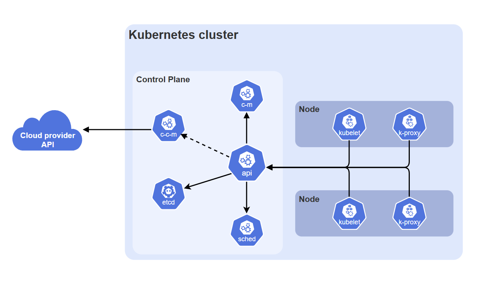
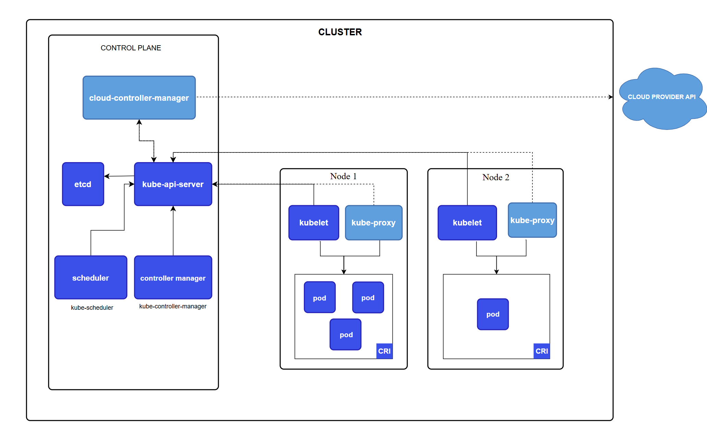

Kubernetes 就是 k8s, 说是 因为它采用了软件工程中一种常见的首尾字母缩写（Numeronym）规则。
具体规则非常简单：
单词的第一个字母是 K
单词的最后一个字母是 s
字母 K 和 s 中间刚好隔着 8 个字母（u-b-e-r-n-e-t-e）
把中间这 8 个字母替换为数字 8，就拼成了 K8s。

cluster -- k8s集群 (一堆部署了k8s的,跑docker的服务器)
kubectl

## 


## Kubectl

Kubectl是一个命令工具，使用该命令工具可以易于管理Cluster里面的docker容器, Kubectl的部署比较简单，详情可以直接查看官网的部署文档, 需要额外注意的就是确保 Kubectl 和 Cluster的版本差在1个版本内:
```
https://kubernetes.io/docs/tasks/tools/install-kubectl-linux/
```

Kubectl 运行在客户端，它的作用是将用户输入的命令，打包成API请求，发送给Cluster。

## Cluster


一个docker集群Cluster包含了一个 Control_Plane 和 一堆Node(工作节点)， Control_Plane 可以理解为 Cluster的大脑，用来调度整个Cluster内的资源，检测和汇报故障。其下包含着多个部件:

### Control_Plane
- kube-apiserver:
    提供 K8s 接口
- etcd: 存储cluster内数据
- kube-scheduler: 对刚加进Cluster内，还没有工作的node节点分配任务，也就是做负载调度的
- kukb-controller-manager: 管理模块，为了降低复杂度，全部的管理模块都被编译到了一个二进制文件，并且整合为一个进程，管理模块负责: 拉起down掉的机器啥啥啥的。
- cloud-controller-manager： 可以把Cluster的内容都推到云平台上，这个玩意我可以先忽略

### Node
Node components run on every node, maintaining running pods and providing the Kubernetes runtime environment.

- kubelet: 本身是一个agent, 运行在Cluster里面的每一个node上，确保每一个node都在跑容器。 每个node跑的容器，所占资源，容器之间如何通信这些信息都写在 Control_Plane 的 PodSpecs 里面，只有节点根据PodSpecs生成出来的容器，Kubelet才能监控。如果是用户手动拉起的，则不在监控范围内
- kube-proxy(可选): 网络的代理，我先不管吧


